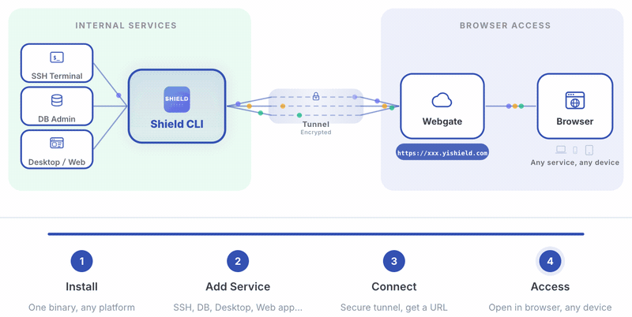

<p align="center">
  
</p>

<h1 align="center">Shield CLI</h1>

<p align="center">
  <strong>浏览器访问一切内部服务。无需 VPN，无需客户端，一条命令。</strong><br>
  Shield CLI 是一个浏览器优先的内网服务网关 — SSH 终端、远程桌面、数据库管理、Web 应用，全部通过浏览器一条命令直达。
</p>

<p align="center">
  <a href="https://docs.yishield.com/guide/what-is-shield">文档中心</a> &bull;
  <a href="https://docs.yishield.com/guide/install">安装</a> &bull;
  <a href="https://docs.yishield.com/guide/quickstart">快速开始</a> &bull;
  <a href="README.md">English</a>
</p>

<p align="center">
  
  
  
</p>

---

## 工作原理

<p align="center">
  
</p>

---

## 演示

### RDP — 浏览器远程桌面

<p align="center">
  
</p>

### SSH — 浏览器终端

<p align="center">
  
</p>

---

## 为什么选择 Shield CLI？

传统工具解决的是**网络可达**（ngrok、frp）或**访问控制**（Teleport、Boundary）— 但仍需安装专用客户端或复杂配置。

Shield CLI 是一个**统一的浏览器入口**，让你通过一条命令，在浏览器中安全访问和操作任何内部服务 — SSH 终端、远程桌面、数据库管理、Web 应用，全部 HTML5 渲染。

| 能力 | Shield CLI | ngrok/frp | Teleport/Boundary |
|------|-----------|-----------|-------------------|
| 浏览器内 RDP/VNC/SSH | 支持 | 不支持 | 部分支持 |
| 数据库 Web 管理 | 支持（插件） | 不支持 | 不支持 |
| 零客户端安装 | 是 | 否 | 否 |
| 单二进制部署 | 是 | 是 | 否 |
| 插件可扩展 | 是 | 否 | 否 |

## 安装

```bash
# macOS
brew tap fengyily/tap && brew install shield-cli

# Windows
scoop bucket add shield https://github.com/fengyily/scoop-bucket && scoop install shield-cli

# Linux (apt) — Debian / Ubuntu
curl -fsSL https://raw.githubusercontent.com/fengyily/shield-cli/main/scripts/setup-repo.sh | sudo bash

# Linux (yum) — RHEL / CentOS / Fedora
curl -fsSL https://raw.githubusercontent.com/fengyily/shield-cli/main/scripts/setup-repo.sh | sudo bash

# Linux / macOS 一键安装（直接下载二进制）
curl -fsSL https://raw.githubusercontent.com/fengyily/shield-cli/main/install.sh | sh

# 国内镜像（推荐）
curl -fsSL https://cdn.jsdelivr.net/gh/fengyily/shield-cli@main/install.sh | sh
```

### Docker

```bash
# 使用预构建镜像（推荐）
docker run -d --name shield \
  --network host \
  --restart unless-stopped \
  fengyily/shield-cli

# 或从源码构建
docker build -t shield-cli .
docker run -d --name shield --network host --restart unless-stopped shield-cli
```

> **说明：** `--network host` 让容器直接使用宿主机网络栈，Shield CLI 可以访问宿主机本机服务以及宿主机所在的内网资源（如 `10.0.0.x`、`192.168.x.x`）。启动后访问 `http://localhost:8181` 即可使用 Web UI。
>
> **注意：** `--network host` 仅在 **Linux** 上生效。macOS 和 Windows 的 Docker Desktop 不支持 host 网络模式，可改用端口映射：
>
> ```bash
> docker run -d --name shield -p 8181:8181 --restart unless-stopped fengyily/shield-cli
> ```

更多安装方式（apt、yum、deb、rpm、PowerShell、源码编译）：[安装指南](https://docs.yishield.com/guide/install)

## 快速开始

### Web UI 模式（推荐）

```bash
shield start
```

打开 `http://localhost:8181`，添加服务，一键连接。macOS 和 Windows 上会在系统托盘显示图标，点击即可快速打开 Dashboard。


### 系统服务安装（开机自启）

```bash
shield install              # 安装为系统服务（默认端口 8181）
shield install --port 8182  # 如果 8181 被占用，指定其他端口
shield start                # 启动服务（如果服务已停止）
shield stop                 # 停止服务
shield uninstall            # 卸载服务
```

`shield install` 后服务会自动启动并开机自启。如果服务被停止，使用 `shield start` 即可重新启动，无需重新安装。

支持 macOS (launchd)、Linux (systemd) 和 Windows。详见[系统服务安装指南](https://docs.yishield.com/guide/system-service)。

### 命令行模式

```bash
shield ssh              # 浏览器内 SSH 终端 (127.0.0.1:22)
shield rdp 10.0.0.5     # 浏览器内 Windows 桌面
shield mysql 10.0.0.20  # 浏览器内数据库管理（插件）
shield http 3000        # 暴露本地 Web 应用
shield vnc 10.0.0.10    # 浏览器内 VNC 屏幕共享
shield tcp 3306         # TCP 端口代理
shield udp 53           # UDP 端口代理
```


### 智能默认值

| 命令 | 解析为 |
|------|--------|
| `shield ssh` | `127.0.0.1:22` |
| `shield ssh 2222` | `127.0.0.1:2222` |
| `shield ssh 10.0.0.2` | `10.0.0.2:22` |
| `shield rdp` | `127.0.0.1:3389` |
| `shield http 3000` | `127.0.0.1:3000` |
| `shield tcp 3306` | `127.0.0.1:3306` |
| `shield udp 53` | `127.0.0.1:53` |

支持协议：`ssh`、`rdp`、`vnc`、`http`、`https`、`telnet`、`tcp`、`udp` — [完整命令参考](https://docs.yishield.com/reference/commands)

## 安全性

- **AES-256-GCM 加密** — 凭证使用机器指纹派生密钥加密
- **密码脱敏** — 日志中所有密码自动隐藏
- **WebSocket 传输** — 带认证的加密隧道
- **0600 权限** — 凭证文件仅当前用户可读

详情：[凭证管理](https://docs.yishield.com/security/credentials) | [访问模式](https://docs.yishield.com/security/access-modes)

## 文档中心

完整文档请访问 **[docs.yishield.com](https://docs.yishield.com)**：

- [Shield CLI 是什么](https://docs.yishield.com/guide/what-is-shield) — 概述和核心特性
- [安装指南](https://docs.yishield.com/guide/install) — 所有安装方式
- [5 分钟上手](https://docs.yishield.com/guide/quickstart) — 快速入门教程
- [协议指南](https://docs.yishield.com/protocols/ssh) — SSH、RDP、VNC、HTTP、Telnet
- [插件系统](https://docs.yishield.com/plugins/) — MySQL 等扩展
- [命令参考](https://docs.yishield.com/reference/commands) — 完整参数列表
- [常见问题](https://docs.yishield.com/reference/faq) — FAQ
- [故障排查](https://docs.yishield.com/troubleshooting/errors) — 常见错误和解决方案

## 许可证

Apache 2.0
