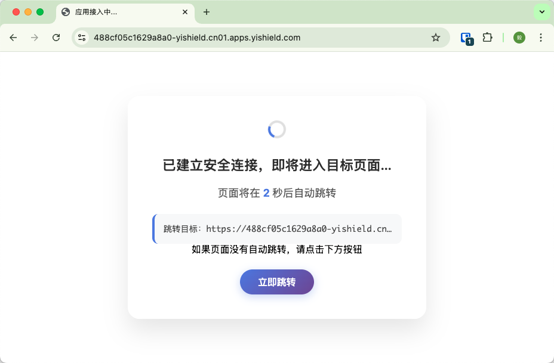

<p align="center">
  
</p>

<h1 align="center">Shield CLI</h1>

<p align="center">
  <strong>基于浏览器的安全内网穿透工具</strong><br>
  通过浏览器直接访问内网的 RDP 远程桌面、VNC 屏幕、SSH 终端和 Web 服务 — 无需安装任何客户端软件。
</p>

<p align="center">
  <a href="#安装">安装</a> &bull;
  <a href="#web-管理平台推荐">快速开始</a> &bull;
  <a href="#可见模式默认">可见模式</a> &bull;
  <a href="#命令参数">命令参数</a> &bull;
  <a href="../README.md">English</a>
</p>

<p align="center">
  
  
  
</p>

---

## 为什么选择 Shield CLI？

传统远程访问需要在每台设备上安装专用客户端（RDP 客户端、VNC Viewer、SSH 终端）。Shield CLI 通过安全网关将内网服务隧道化，所有操作都在**浏览器中完成**。

- **无需安装客户端** — 在任意浏览器中打开链接即可访问 RDP 桌面、VNC 屏幕或 SSH 终端
- **随处可用** — 手机、平板、受限的企业电脑，任何有浏览器的设备都能访问
- **Web 管理面板** — 通过浏览器管理多个服务，保存配置，一键连接
- **命令行同样支持** — 在无桌面的 Linux 服务器上，通过一条命令即可完成隧道创建

## 安装

### macOS (Homebrew)

```bash
brew tap fengyily/tap
brew install shield-cli
```

### Windows (Scoop)

```powershell
scoop bucket add shield https://github.com/fengyily/scoop-bucket
scoop install shield-cli
```

### Windows (PowerShell 一键安装)

```powershell
irm https://raw.githubusercontent.com/fengyily/shield-cli/main/install.ps1 | iex
```

### Linux / macOS (curl 一键安装)

```bash
curl -fsSL https://raw.githubusercontent.com/fengyily/shield-cli/main/install.sh | sh
```

### Debian / Ubuntu (.deb)

```bash
# 从 GitHub Releases 下载
sudo dpkg -i shield-cli_<version>_linux_amd64.deb
```

### RHEL / CentOS (.rpm)

```bash
sudo rpm -i shield-cli_<version>_linux_amd64.rpm
```

### 从源码编译

```bash
git clone https://github.com/fengyily/shield-cli.git
cd shield-cli
go build -o shield .
```

## 快速开始

### Web 管理平台（推荐）

最简单的方式 — 启动 Web 管理面板，在浏览器中完成所有操作：

```bash
shield start
```

打开 `http://localhost:8181`，添加服务，一键连接。

- **保存最多 10 个应用** — 配置协议、IP、端口和显示名称
- **一键连接/断开** — 最多同时管理 3 个隧道连接
- **实时状态** — 自动刷新连接状态（连接中、已连接、失败）
- **深色/浅色主题** — 切换主题以适应不同使用环境
- **自动跳转** — 连接成功后自动在新标签页打开 Access URL


```bash
# 指定自定义端口启动
shield start 9090
```

Web 管理平台会在本地加密保存应用配置和凭证，无需每次重新配置或认证。

### 命令行（适用于服务器和脚本）

在无桌面的 Linux 服务器或自动化脚本中，直接使用命令行：

```bash
# 暴露本地 SSH — 在浏览器中访问终端
shield ssh

# 暴露远程 RDP 桌面
shield rdp 10.0.0.5

# 暴露本地 3000 端口的开发服务
shield http 3000

# 暴露远程 VNC 服务（自定义端口）
shield vnc 10.0.0.10:5901
```

隧道建立后，在任意浏览器中打开 **Access URL** 即可访问。

**第一步：** 运行 `shield ssh` 创建隧道


**第二步：** 打开 Access URL — 自动授权跳转



**第三步：** 浏览器中的 SSH 终端 — 无需安装客户端


### 智能默认值

| 命令 | 解析为 |
|---|---|
| `shield ssh` | `127.0.0.1:22` |
| `shield ssh 2222` | `127.0.0.1:2222` |
| `shield ssh 10.0.0.2` | `10.0.0.2:22` |
| `shield ssh 10.0.0.2:2222` | `10.0.0.2:2222` |
| `shield http` | `127.0.0.1:80` |
| `shield http 3000` | `127.0.0.1:3000` |
| `shield rdp` | `127.0.0.1:3389` |
| `shield vnc` | `127.0.0.1:5900` |
| `shield https` | `127.0.0.1:443` |
| `shield telnet` | `127.0.0.1:23` |

支持的协议：`ssh`、`http`、`https`、`rdp`、`vnc`、`telnet`

## 可见模式（默认）

默认情况下，隧道处于**可见模式** — 拥有 Access URL 的人可以直接连接。隧道建立后 Access URL 会打印在终端中。

```bash
shield ssh 10.0.0.2
shield rdp 10.0.0.5
```

可以通过名称过滤指定 AC 节点：

```bash
shield --visable=HK ssh 10.0.0.2
```

**适用场景：** 开发服务器、演示环境、预发布环境、团队协作。

## 命令参数

```
shield <protocol> [ip:port] [flags]

参数:
  -H, --server string         API 服务器地址 (默认: https://console.yishield.com/raas)
  -p, --tunnel-port int       隧道服务器端口 (默认: 62888)
      --visable [过滤词]      AC 节点名称过滤 (默认: 可见模式)
      --display-name string   连接器显示名称
      --site-name string      应用站点名称
      --username string       目标服务用户名 (SSH/RDP/VNC)
      --auth-pass string      目标服务密码 (SSH/RDP/VNC)
      --private-key string    SSH 私钥
      --passphrase string     SSH 私钥密码
      --enable-sftp           启用 SFTP (仅 SSH)
  -v, --verbose               启用详细日志输出
  -h, --help                  显示帮助信息

子命令:
  start [port]                启动 Web 管理平台 (默认端口: 8181)
  clean                       清除缓存的凭证
```

### 本地 API

Shield CLI 运行后会在 `127.0.0.1:<port>` 上提供本地管理接口：

| 接口 | 方法 | 说明 |
|---|---|---|
| `/health` | GET | 健康检查 |
| `/connectors` | GET | 列出所有活跃隧道 |
| `/connector?rport=&lip=&lport=` | GET | 创建动态隧道 |
| `/connector?rport=` | DELETE | 关闭隧道 |

## 工作原理

```
                      浏览器 (通过 HTML5 访问 RDP/VNC/SSH)
                                │
                                ▼
┌──────────────┐      ┌──────────────┐      ┌──────────────┐
│  内网服务      │ ◄──► │  Shield CLI   │ ◄══► │  公网网关      │
│  10.0.0.5:    │ 本地  │  (隧道)       │chisel│  + Web UI    │
│  3389/5900/22 │      └──────────────┘wss://└──────────────┘
└──────────────┘
```

## 安全性

- 凭证使用 AES-256-GCM 加密，密钥基于机器指纹派生
- 所有日志输出中的密码均已脱敏
- 隧道连接使用带认证的 WebSocket 传输
- 凭证文件权限为 `0600`

## 路线图

### 核心功能

- [x] 加密隧道 — 基于 chisel 的安全 WebSocket 传输
- [x] 多协议支持 — SSH、HTTP、HTTPS、RDP、VNC、Telnet
- [x] 智能默认值 — 自动识别 IP 和端口，最少输入即可启动
- [x] 跨平台 — 原生支持 Linux、macOS、Windows（amd64/arm64）
- [x] 包管理器分发 — Homebrew、Scoop、deb、rpm、curl/PowerShell 一键安装
- [x] 自动凭证 — 基于机器指纹的身份标识，AES-256-GCM 加密存储
- [x] 可见模式 — 按隧道控制访问授权策略
- [ ] 隐身模式 — 需要通过带授权密钥的 Access URL 才能访问
- [x] 动态隧道 — 运行时通过本地 REST API 管理隧道
- [x] 断线自动重连 — 连接失败时指数退避重试
- [ ] 服务端开源 — 支持私有化部署，数据和基础设施完全自主可控
- [x] 持久化配置 — 支持保存最多 10 个应用配置，本地加密存储
- [x] 本地 Web UI — 在 `localhost:8181` 提供浏览器管理面板，管理应用、连接和状态
- [ ] 多隧道模式 — 单进程运行多条隧道，通过配置文件统一管理（`shield up`）

### 用户体验

- [x] 零配置快速启动 — `shield ssh` 即可使用，无需任何参数
- [x] 智能地址解析 — 支持 `shield ssh`、`shield ssh 2222`、`shield ssh 10.0.0.2`、`shield ssh 10.0.0.2:2222`
- [x] 简洁终端界面 — Banner、隧道映射、Access URL 清晰展示
- [x] 安装后使用提示 — Homebrew 安装完成后自动显示使用示例
- [ ] 交互式初始化向导 — 首次使用时通过 `shield init` 引导配置
- [ ] 二维码输出 — 终端直接显示 Access URL 二维码，手机扫码即可访问
- [ ] 连接健康监控 — 终端实时显示延迟、带宽、在线时长等指标
- [ ] 断线自动重连并恢复会话 — 无缝恢复连接，无需重新生成 URL
- [ ] 通知回调 — 隧道连接/断开时通过 Webhook / 企业微信 / 钉钉 / 邮件通知

### 团队与企业

- [ ] 团队工作空间 — 共享隧道面板、邀请成员、基于角色的访问控制
- [ ] 审计日志 — 记录谁在什么时间访问了什么服务，支持完整会话录制
- [ ] SSO 集成 — 通过 SAML / OIDC 登录授权 Access URL
- [ ] 自定义域名 — 使用自有域名替代 `*.apps.yishield.com`
- [ ] IP 白名单 — 限制 Access URL 仅允许特定 IP 或 CIDR 范围访问
- [ ] 隧道过期策略 — 自动关闭（N 小时后）、定时访问窗口

### 增值服务

- [ ] 文件传输 — 通过浏览器上传/下载文件（SFTP、SCP）
- [ ] 会话录制与回放 — 录制 RDP/VNC/SSH 会话，用于培训和审计
- [ ] 多区域中继 — 选择不同地区的出口节点，降低延迟
- [ ] API 网关模式 — 暴露 REST/gRPC 接口，支持限流、认证和监控
- [ ] 移动端 App — iOS/Android 管理隧道和快速访问

## 许可证

Apache 2.0
