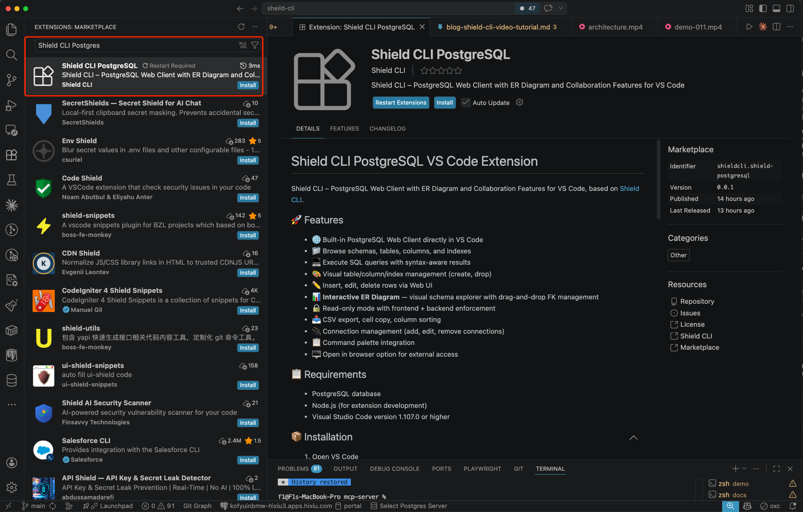
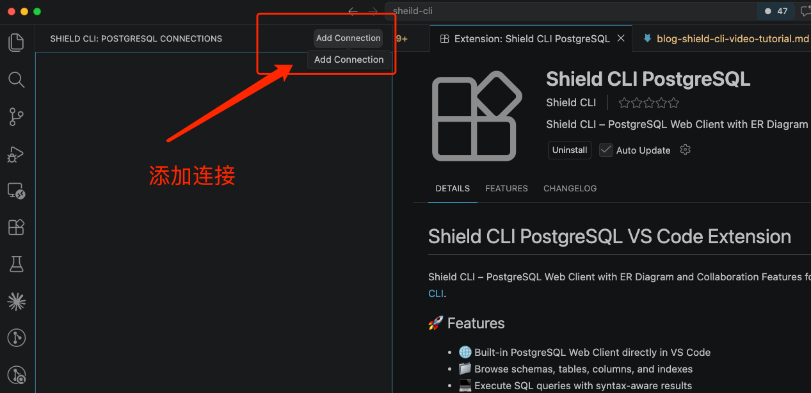
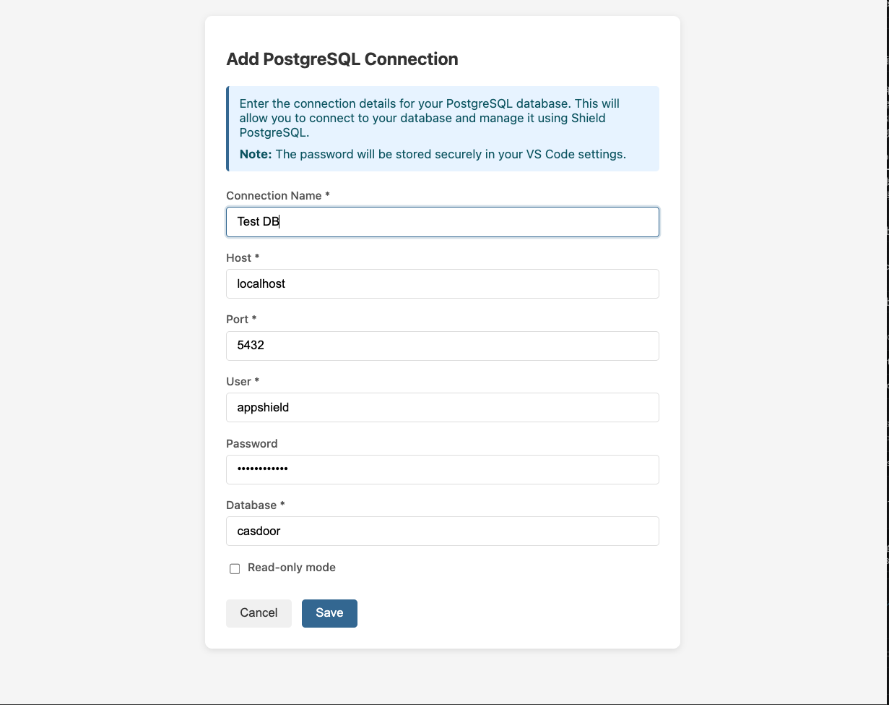
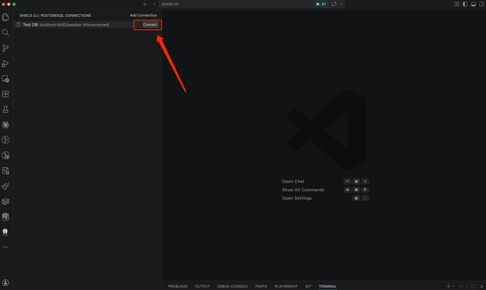
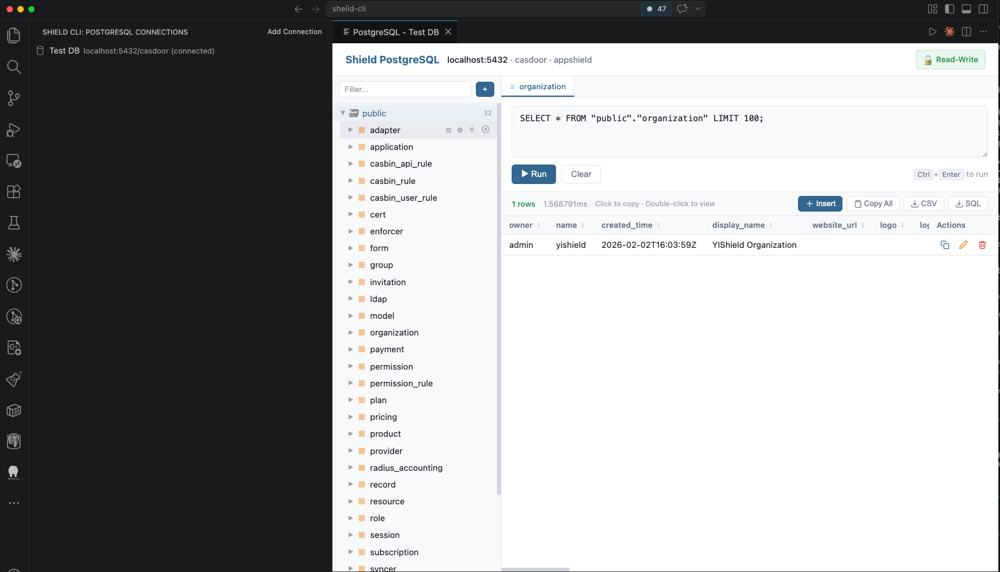
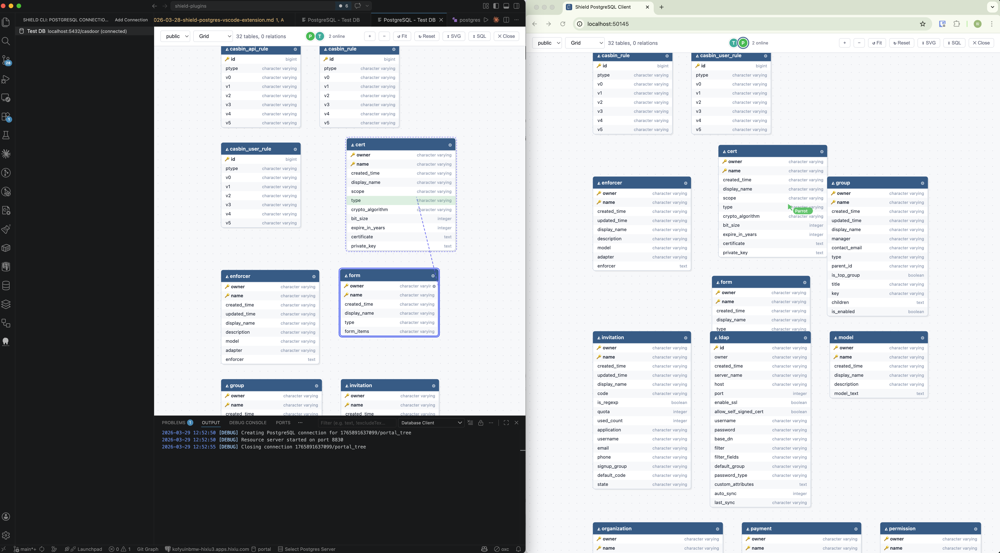

# Shield CLI PostgreSQL 插件现已上架 VS Code 扩展市场

> PostgreSQL 插件从命令行走进了编辑器。Shield CLI PostgreSQL VS Code Extension 今天在扩展市场正式上架，写代码的同时，不用切窗口就能查库、改数据、看 ER 图。

---

## 在 VS Code 里安装

打开扩展面板，搜索 **Shield CLI PostgreSQL**，点 Install。

安装完成后，左侧活动栏会出现 Shield CLI 的图标，点击展开连接管理面板。

---

## 添加第一个连接

点击面板右上角的 **Add Connection**。

填写连接信息：连接名、Host、Port、用户名、密码、数据库名，根据需要勾选只读模式。

保存后，连接出现在左侧列表，点 **Connect** 建立连接。

---

## 连上之后能做什么

连接成功后，VS Code 内嵌的 PostgreSQL Web 客户端会自动打开。

主要功能：

- **Schema 树形浏览**：左侧展示 Schema → Table → Column/Index 三级结构，支持搜索过滤
- **SQL 编辑器**：多标签页，`Ctrl+Enter` 执行，结果支持排序、CSV 导出、单元格复制
- **行级操作**：插入、双击编辑、删除，带确认提示
- **表结构管理**：可视化创建/删除表、添加/删除字段、管理索引，完整支持 PG 类型（`SERIAL`、`JSONB`、`UUID`、`TIMESTAMPTZ` 等）
- **只读模式**：前后端双重拦截写操作，前端锁住按钮，后端也会拦截，不能被绕过

---

## ER 图：在 VS Code 里看表关系

同样支持 ER 图——可视化展示当前 Schema 下所有表的字段和外键关系，支持拖拽建外键、右键建表改字段。

在编辑器里写代码，切到 ER 图确认一下外键设计，再切回来继续写——不用开第三个工具了。

---

## 在浏览器里打开

如果需要分享给没有 VS Code 的同事，或者在大屏上展示，点击右上角的 **Open in Browser**，在默认浏览器打开同一个 Web 客户端界面。链接发出去，对方浏览器打开就能用。

---

## 和命令行版本的关系

VS Code 扩展和 Shield CLI 命令行版本共用同一套后端逻辑。

| 使用方式 | 适合场景 |
|---|---|
| VS Code 扩展 | 写代码时顺手查库，不想切窗口 |
| `shield postgres` 命令行 | 临时连接、脚本化、给没有 VS Code 的人用 |
| Docker 镜像 | 一次性任务，用完删掉 |

三种方式都支持只读模式、ER 图、SQL 查询，选哪个看使用场景。

---

## 扩展主要功能清单

- 内嵌 PostgreSQL Web 客户端，无需切换窗口
- Schema、表、列、索引完整浏览
- SQL 编辑器，多标签页，带语法高亮和查询结果
- 表结构可视化管理（建表、加字段、建索引、删除）
- 行级操作：插入、编辑、删除
- 交互式 ER 图，拖拽建外键
- 只读模式，前后端双重拦截
- CSV 导出、单元格复制、列排序
- 连接管理（新增、编辑、删除）
- 命令面板集成
- 支持在浏览器中打开

---

## 安装

在 VS Code 扩展面板搜索 **Shield CLI PostgreSQL**，或者访问扩展市场页面直接安装。

主程序和插件仓库：

- Shield CLI：https://github.com/fengyily/shield-cli
- 插件源码：https://github.com/fengyily/shield-plugins

有问题或建议欢迎提 [Issue](https://github.com/fengyily/shield-cli/issues)。
