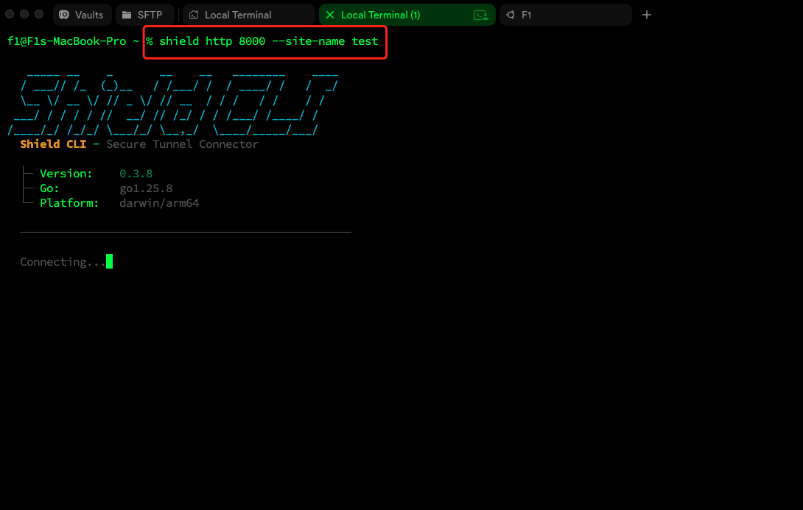
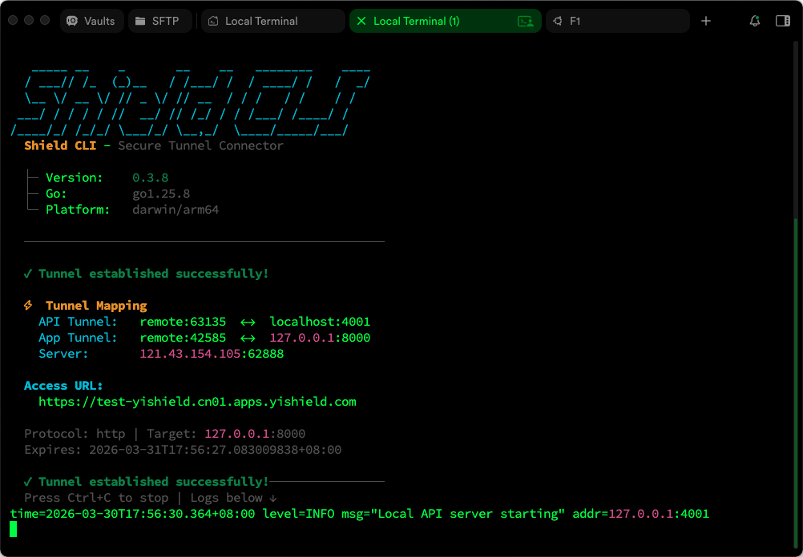
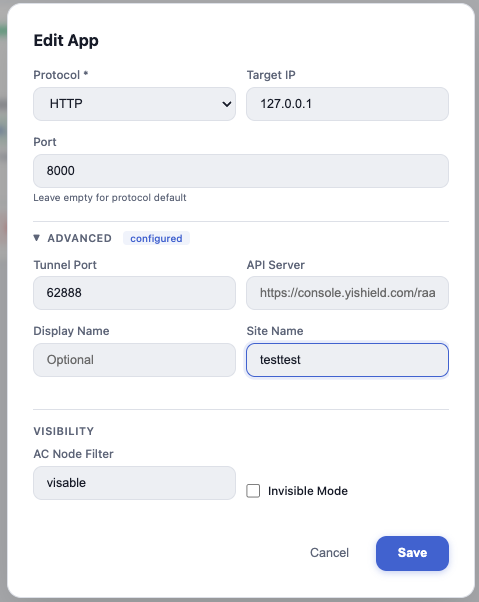
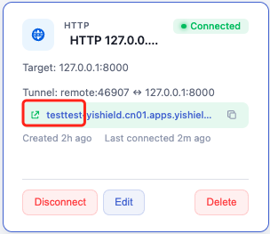
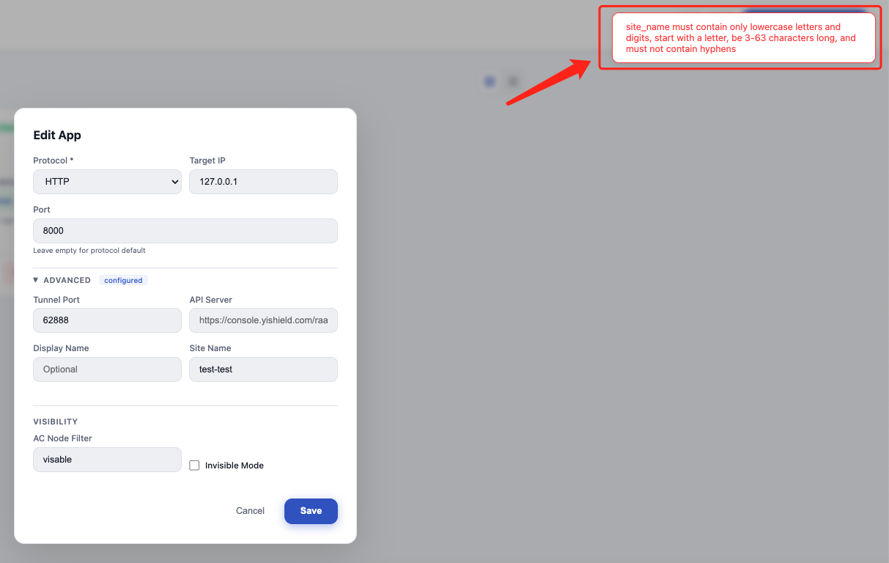

# Shield CLI 新功能：自定义域名前缀

> 一条命令，让你的隧道地址从 `a3x9k2.apps.yishield.com` 变成 `myapp.apps.yishield.com`。

## 痛点：随机地址不好用

使用 Shield CLI 暴露本地服务时，系统会自动分配一个随机的子域名作为公网访问地址。虽然功能上没有任何问题，但在实际使用中你可能会遇到这些场景：

- **给客户演示**——发一个 `a3x9k2.apps.yishield.com` 的链接，看起来不够专业
- **团队协作**——多个服务同时运行，随机地址难以区分哪个是哪个
- **反复调试**——每次重新建立隧道地址都变了，文档和配置中的链接全部失效
- **Webhook 回调**——第三方服务配置了回调地址，隧道重建后地址变更导致回调失败

## 解决方案：`--site-name` 参数

从 v0.3.8 开始，Shield CLI 支持通过 `--site-name` 参数自定义域名前缀：

```bash
shield http 8000 --site-name myapp
```

执行后，你的服务将通过 `myapp.apps.yishield.com` 访问，而不是一串随机字符。



连接成功后，可以看到隧道已建立，分配的地址正是你指定的前缀：



## 两种设置方式

### 方式一：命令行参数

最直接的方式，在启动命令中指定：

```bash
# 暴露本地 8000 端口，自定义域名前缀为 test
shield http 8000 --site-name test

# 暴露 SSH 服务
shield ssh 10.0.0.5 --site-name dev-server

# 暴露 React 开发服务器
shield http 3000 --site-name frontend
```

### 方式二：Web UI 编辑

如果你已经通过 `shield start` 启动了 Web 管理界面，也可以在编辑应用时设置 Site Name。

展开 **ADVANCED** 配置区域，在 **Site Name** 字段中填入你想要的域名前缀：



设置完成后，应用卡片上会直接显示你的自定义域名：



## 命名规则

Site Name 不是随意填写的，需要遵循以下规则：

| 规则 | 说明 |
|------|------|
| 仅限小写字母和数字 | `myapp123` ✅ &nbsp; `My-App` ❌ |
| 必须以字母开头 | `app1` ✅ &nbsp; `1app` ❌ |
| 长度 3 ~ 63 个字符 | `ab` ❌ &nbsp; `abc` ✅ |
| 不允许连字符 | `myapp` ✅ &nbsp; `my-app` ❌ |

如果输入不符合规则，无论是命令行还是 Web UI 都会给出明确的错误提示：



命令行同样会校验：

```bash
$ shield http 8000 --site-name test-bad
Error: invalid site name: "test-bad"
```

## 实用场景

### 客户演示

```bash
shield http 3000 --site-name demo
# 访问地址：demo.apps.yishield.com
```

发给客户一个干净的链接，比随机字符串专业得多。

### 多服务区分

```bash
# 终端 1：前端
shield http 3000 --site-name frontend

# 终端 2：后端 API
shield http 8080 --site-name api

# 终端 3：管理后台
shield http 9090 --site-name admin
```

一目了然，不用再猜哪个地址对应哪个服务。

### Webhook / 回调地址

```bash
shield http 8000 --site-name webhook
# 访问地址：webhook.apps.yishield.com
```

在第三方平台配置好回调地址后，即使本地重启隧道，只要使用相同的 `--site-name`，地址不变，回调不断。

## 快速上手

```bash
# 1. 安装或升级到最新版
brew upgrade shield-cli
# 或
curl -fsSL https://raw.githubusercontent.com/fengyily/shield-cli/main/install.sh | sh

# 2. 验证版本 >= 0.3.8
shield --version

# 3. 使用自定义域名前缀启动
shield http 3000 --site-name myapp

# 4. 浏览器访问 myapp.apps.yishield.com
```

---

**相关链接**：
- [Shield CLI 官方文档](https://docs.yishield.com)
- [GitHub 仓库](https://github.com/fengyily/shield-cli)
- [HTTP/HTTPS 协议文档](https://docs.yishield.com/docs/protocols/http.html)
